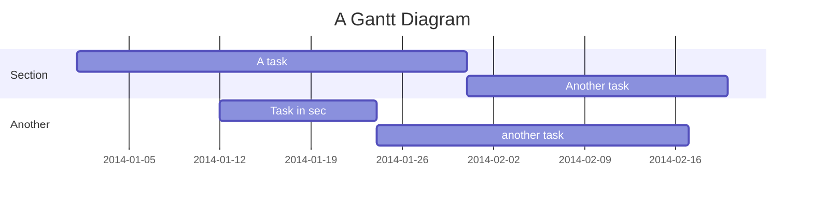
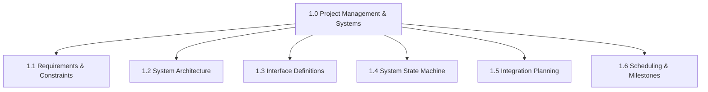
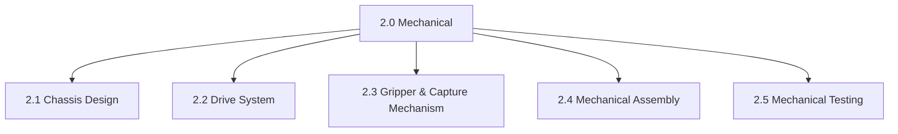
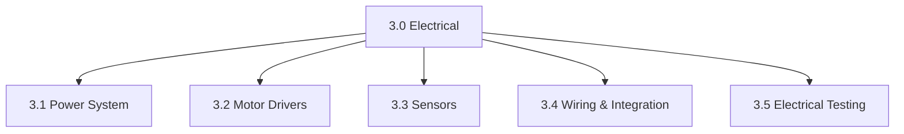
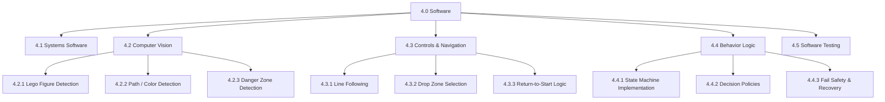
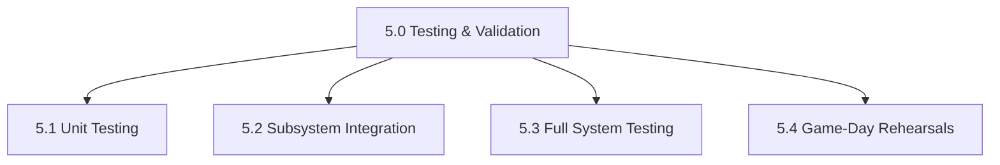
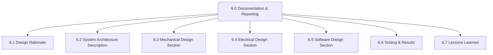

```mermaid
    gantt
        title A Gantt Diagram
        dateFormat  YYYY-MM-DD
        section Section
        A task           :a1, 2014-01-01, 30d
        Another task     :after a1  , 20d
        section Another
        Task in sec      :2014-01-12  , 12d
        another task      : 24d

```

```mermaid
    flowchart TB
        PM["1.0 Project Management & Systems"]
        PM --> PM1["1.1 Requirements & Constraints"]
        PM --> PM2["1.2 System Architecture"]
        PM --> PM3["1.3 Interface Definitions"]
        PM --> PM4["1.4 System State Machine"]
        PM --> PM5["1.5 Integration Planning"]
        PM --> PM6["1.6 Scheduling & Milestones"]
```

```mermaid
    flowchart TB
        ME["2.0 Mechanical"]
        ME --> ME1["2.1 Chassis Design"]
        ME --> ME2["2.2 Drive System"]
        ME --> ME3["2.3 Gripper & Capture Mechanism"]
        ME --> ME4["2.4 Mechanical Assembly"]
        ME --> ME5["2.5 Mechanical Testing"]

```

```mermaid
    flowchart TB
        EE["3.0 Electrical"]
        EE --> EE1["3.1 Power System"]
        EE --> EE2["3.2 Motor Drivers"]
        EE --> EE3["3.3 Sensors"]
        EE --> EE4["3.4 Wiring & Integration"]
        EE --> EE5["3.5 Electrical Testing"]

```

```mermaid
    flowchart TB
        SW["4.0 Software"]
    
        SW --> SW1["4.1 Systems Software"]
        SW --> SW2["4.2 Computer Vision"]
        SW --> SW3["4.3 Controls & Navigation"]
        SW --> SW4["4.4 Behavior Logic"]
        SW --> SW5["4.5 Software Testing"]
    
        SW2 --> CV1["4.2.1 Lego Figure Detection"]
        SW2 --> CV2["4.2.2 Path / Color Detection"]
        SW2 --> CV3["4.2.3 Danger Zone Detection"]
    
        SW3 --> CT1["4.3.1 Line Following"]
        SW3 --> CT2["4.3.2 Drop Zone Selection"]
        SW3 --> CT3["4.3.3 Return-to-Start Logic"]
    
        SW4 --> BL1["4.4.1 State Machine Implementation"]
        SW4 --> BL2["4.4.2 Decision Policies"]
        SW4 --> BL3["4.4.3 Fail Safety & Recovery"]
```

```mermaid

    flowchart TB
        TS["5.0 Testing & Validation"]
    
        TS --> TS1["5.1 Unit Testing"]
        TS --> TS2["5.2 Subsystem Integration"]
        TS --> TS3["5.3 Full System Testing"]
        TS --> TS4["5.4 Game-Day Rehearsals"]

```

```mermaid
    flowchart TB
        RP["6.0 Documentation & Reporting"]
    
        RP --> RP1["6.1 Design Rationale"]
        RP --> RP2["6.2 System Architecture Description"]
        RP --> RP3["6.3 Mechanical Design Section"]
        RP --> RP4["6.4 Electrical Design Section"]
        RP --> RP5["6.5 Software Design Section"]
        RP --> RP6["6.6 Testing & Results"]
        RP --> RP7["6.7 Lessons Learned"]

```

