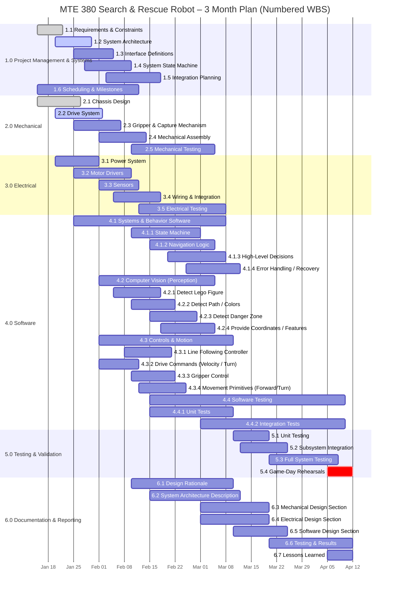
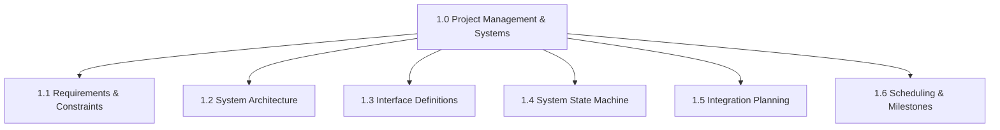
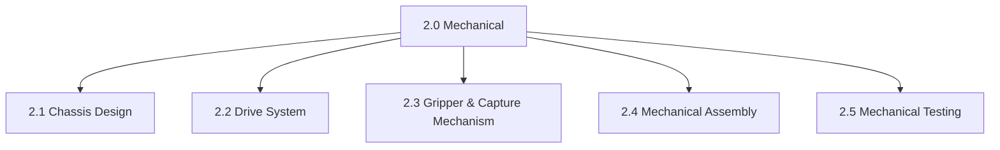
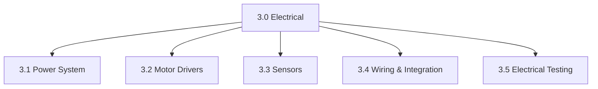
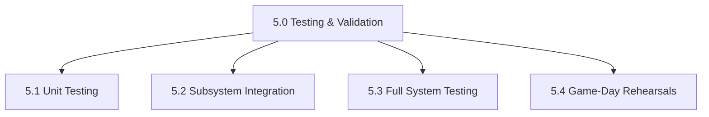
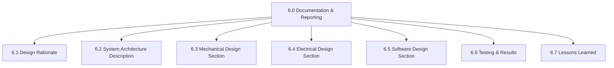

```mermaid
flowchart TB
    SW["4.0 Software"]

    %% HIGH LEVEL
    SW --> SYS["4.1 Systems & Behavior Software"]
    SW --> CV["4.2 Computer Vision (Perception)"]
    SW --> CTRL["4.3 Controls & Motion"]
    SW --> TEST["4.4 Software Testing"]

    %% SYSTEMS LAYER (Decision-making)
    SYS --> SYS1["4.1.1 State Machine"]
    SYS --> SYS2["4.1.2 Navigation Logic"]
    SYS --> SYS3["4.1.3 High-Level Decisions"]
    SYS --> SYS4["4.1.4 Error Handling / Recovery"]

    %% CV LAYER (Perception only)
    CV --> CV1["4.2.1 Detect Lego Figure"]
    CV --> CV2["4.2.2 Detect Path / Colors"]
    CV --> CV3["4.2.3 Detect Danger Zone"]
    CV --> CV4["4.2.4 Provide Coordinates / Features"]
    
    %% CONTROLS LAYER (Low-level actuation)
    CTRL --> CTRL1["4.3.1 Line Following Controller"]
    CTRL --> CTRL2["4.3.2 Drive Commands (Velocity / Turn)"]
    CTRL --> CTRL3["4.3.3 Gripper Control"]
    CTRL --> CTRL4["4.3.4 Movement Primitives (Forward/Turn)"]

    %% TESTING
    TEST --> TEST1["4.4.1 Unit Tests"]
    TEST --> TEST2["4.4.2 Integration Tests"]
```

# GROUP CONTRACT (1-PAGE HARD VERSION)

**Project:** ___________________________  
**Course:** ___________________________  
**Term:** ___________________________  

---

## 1. Purpose
This contract defines mandatory expectations for participation, professionalism, and accountability. Its purpose is to ensure fair workload distribution, timely progress, and successful project completion. By signing, all members agree to be held to these standards.

---

## 2. Attendance & Punctuality
- All members must attend all scheduled meetings and arrive on time.  
- <5 minutes late: may join quietly; catching up is optional.  
- >5 minutes late without notice:
  - Must explain absence,
  - Accept responsibility for missed work,
  - Complete one additional minor task.
- More than **two (2) unexcused absences** may result in dismissal from the group and instructor notification.

**Initials:** _______

---

## 3. Academic Integrity
- Any plagiarism or academic dishonesty will be reported immediately.
- All members agree to comply with university Academic Honesty policies.

**Initials:** _______

---

## 4. Professional Conduct
- Respect is mandatory. Personal attacks, dismissive language, or hostility are unacceptable.
- Criticism must address ideas, not individuals.
- Violations result in:
  1. Formal warning,
  2. Documentation,
  3. Escalation to the instructor.

**Initials:** _______

---

## 5. Leadership & Decision-Making
- The group recognizes a **Project Lead** responsible for coordination, timelines, and integration.
- Decisions follow this order:
  1. Consensus,
  2. Majority vote,
  3. Project Lead decision if time-critical.
- The Project Lead is **not responsible for compensating for underperforming members**.

**Initials:** _______

---

## 6. Deadlines & Work Quality
- Missed deadlines without prior notice:
  - Must be completed within 24 hours,
  - Trigger one additional assigned task.
- Repeated offenses:
  - Second: formal warning,
  - Third: instructor notification and grading adjustment.
- All work must be complete, functional, and integration-ready. Low-effort work counts as a missed deadline.

**Initials:** _______

---

## 7. Contribution & Accountability
- Each member must contribute:
  - At least one technical component,
  - At least one collaborative component.
- Weekly progress updates are mandatory.
- **Three consecutive weeks of inadequate contribution** may result in:
  - Task reassignment,
  - Documentation,
  - Instructor escalation,
  - Peer evaluation penalties.

**Initials:** _______

---

## 8. Meetings & Focus
- No interrupting or cross-talking.
- Disengagement or disruption results in:
  1. Reminder,
  2. Private warning,
  3. Documentation and escalation.

**Initials:** _______

---

## 9. Agreement
By signing below, each member agrees to abide by this contract and accepts its enforcement.

**Date:** ______________________

| Print Name | Signature |
|-----------|-----------|
| | |
| | |
| | |
| | |

