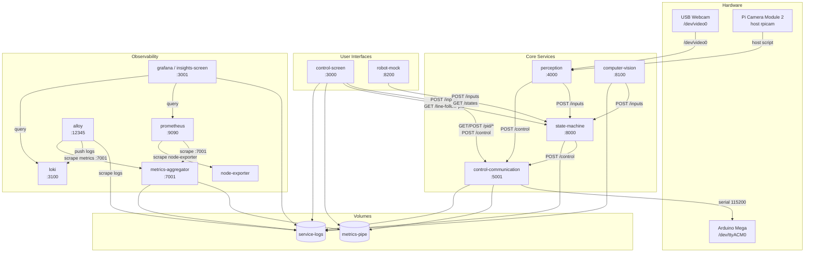

```mermaid
flowchart TD
    subgraph Hardware
        ARD[Arduino Mega\n/dev/ttyACM0]
        CAM[USB Webcam\n/dev/video0]
        PICAM[Pi Camera Module 2\nhost rpicam]
    end

    subgraph Core["Core Services"]
        PERC[perception\n:4000]
        CV[computer-vision\n:8100]
        SM[state-machine\n:8000]
        CC[control-communication\n:5001]
    end

    subgraph UI["User Interfaces"]
        CS[control-screen\n:3000]
        MOCK[robot-mock\n:8200]
    end

    subgraph Observability
        MA[metrics-aggregator\n:7001]
        PROM[prometheus\n:9090]
        LOKI[loki\n:3100]
        ALLOY[alloy\n:12345]
        NE[node-exporter]
        GF[grafana / insights-screen\n:3001]
    end

    subgraph Volumes
        MPIPE[(metrics-pipe)]
        SLOGS[(service-logs)]
    end

    CAM -->|/dev/video0| PERC
    PICAM -->|host script| PERC
    PERC -->|POST /inputs| SM
    PERC -->|POST /control| CC

    CV -->|POST /inputs| SM

    SM -->|POST /control| CC
    CC -->|serial 115200| ARD

    CS -->|GET/POST /pid/*\nPOST /control| CC
    CS -->|POST /inputs\nGET /line-follow-pid| SM

    MOCK -->|POST /inputs\nGET /states| SM

    CC --> MPIPE
    CS --> MPIPE
    MA --> MPIPE

    CC --> SLOGS
    CS --> SLOGS
    MA --> SLOGS
    SM --> SLOGS
    CV --> SLOGS
    GF --> SLOGS

    ALLOY -->|scrape logs| SLOGS
    ALLOY -->|push logs| LOKI
    ALLOY -->|scrape metrics :7001| MA

    PROM -->|scrape :7001| MA
    PROM -->|scrape node-exporter| NE

    GF -->|query| PROM
    GF -->|query| LOKI
```
