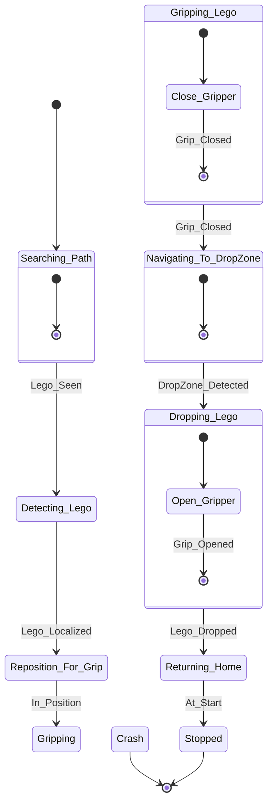

```mermaid
stateDiagram-v2
    [*] --> Searching_Path

    %% ---------------------------
    %% MAIN MISSION STATES
    %% ---------------------------
    state Searching_Path {
        [*] --> [*]
    }
    state Gripping_Lego {
        [*] --> Close_Gripper
        Close_Gripper --> [*]: Grip_Closed  
    }
    state Dropping_Lego {
        [*] --> Open_Gripper
        Open_Gripper --> [*]: Grip_Opened
    }
    state Navigating_To_DropZone {
        [*] --> [*]
    }
    Searching_Path --> Detecting_Lego: Lego_Seen

    Detecting_Lego --> Reposition_For_Grip: Lego_Localized

    Reposition_For_Grip --> Gripping: In_Position

    %% ---------------------------
    %% SIMPLE GRIPPING SUB-FSM
    %% ---------------------------


    %% Return to parent FSM
    Gripping_Lego --> Navigating_To_DropZone: Grip_Closed

    Navigating_To_DropZone --> Dropping_Lego: DropZone_Detected

    Dropping_Lego --> Returning_Home: Lego_Dropped

    Returning_Home --> Stopped: At_Start

    Crash --> [*]
    Stopped --> [*]


```