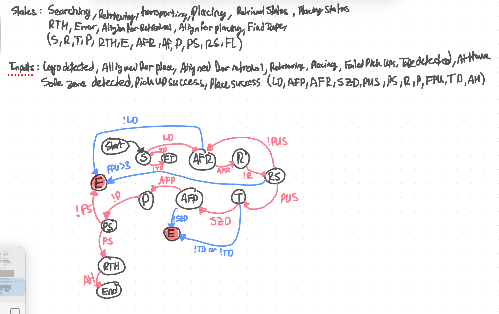

# Purpose
State machine that ingests information and provides system state outputs for control system.

# Functions
- State machine that ingests information and provides system state outputs for control system.


# Technologies
- C++

# Ingress
- `GET /health` for liveness
- `GET /inputs` to inspect the latest buffered inputs (debug)
- `POST /inputs` to send computer-vision-style inputs (JSON)

# Egress
REST API calls to control communication system to get PID parameters and system state.
REST API calls to computer vision system to get object detection and distance data.

# Build/Run
- Docker: built and run via `system/docker-compose.yaml` (`state-machine` service).
- Local deps (macOS): `brew install boost nlohmann-json cmake`
- Local deps (Linux): `sudo apt-get install -y libboost-all-dev nlohmann-json3-dev cmake`
- Local (CMake):
```
cmake -S . -B build
cmake --build build
./build/state-machine
```
- If CMake cannot find Boost/nlohmann-json on macOS, add `-DCMAKE_PREFIX_PATH="$(brew --prefix)"`.
- Local (manual compile): `c++ -std=c++17 -O2 -pthread -o state-machine main.cpp -lboost_system`
